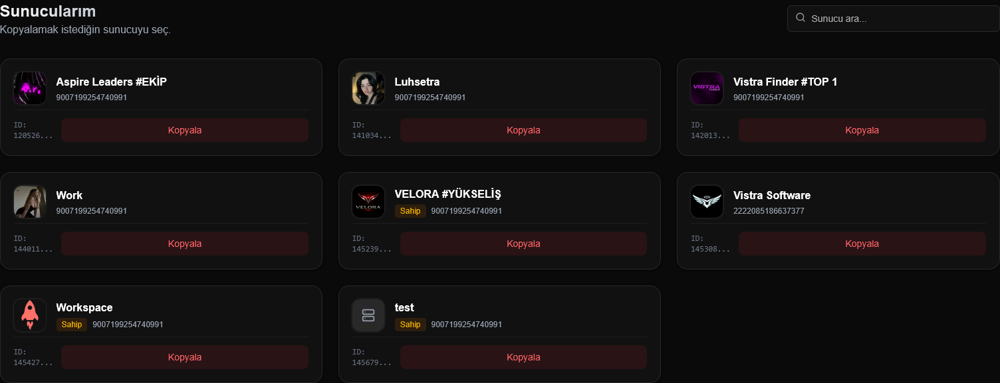
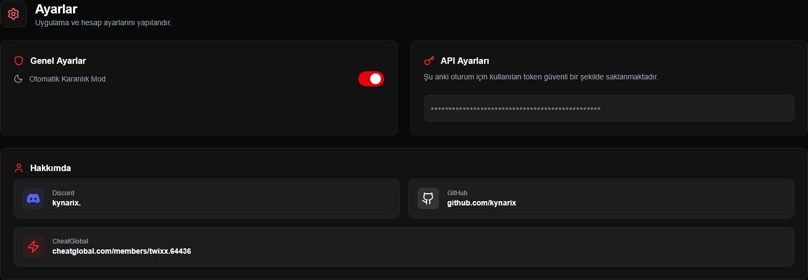
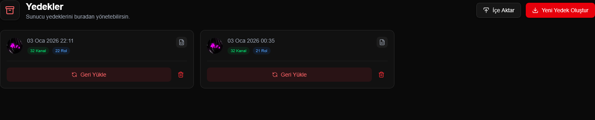

# Kynarix Cloner | Next-Gen Discord Server Cloner


> **"Sıradan olanı değil, mükemmel olanı kopyala."**  
> Kynarix Cloner, Discord sunucularını atomlarına kadar yedekleyip saniyeler içinde geri yüklemenizi sağlayan, modern ve güçlü bir araçtır.

## Öne Çıkan Özellikler

*   **Hızlı Kopyalama:** Kanallar, roller, izinler ve emojiler... Hepsi saniyeler içinde klonlanır.

*   **Bot Otomatik Entegrasyon:** Botları davet linkiyle uğraşmadan, **tek tıkla** ve **sessizce** hedef sunucuya ekler.

*   **Tam Yedekleme:** Sunucunun bir kopyasını `.json` olarak indirip dilediğiniz zaman geri yükleyin.

*   **Akıllı Temizlik:** Hedef sunucuyu işlem öncesi tertemiz yapar (Opsiyonel).

---

## Arayüzden Kareler

| Dashboard | Ayarlar | Yedekler |
| :---: | :---: | :---: |
|  |  |  |
| *Sunucularınızı yönetin ve kopyalamayı başlatın.* | *Profilinizi ve sistem ayarlarınızı yapılandırın.* | *Tüm yedeklerinizi tek bir yerden kontrol edin.* |

---

## Kurulum & Başlangıç

### 1. Gereksinimler
*   Node.js (v18+)
*   Bir adet Discord Kullanıcı Token 

### 2. Kurulum
Terminali açın ve komutları yazın:

```bash
# Bağımlılıkları yükle
npm install

# Sunucuyu başlat
npm run dev
```

### 3. Kullanım
Tarayıcınızda `http://localhost:3000` adresine gidin.
1.  **Giriş Yap:** Token bilginizle sisteme giriş yapın.
2.  **Kopyala:** Kopyalamak istediğiniz sunucuyu seçin.
3.  **İzle:** Arkanıza yaslanın ve keyfinize bakın.


---

> ⚠️ **Uyarı:** Bu araç Discord hesabınızın doğrulamaya düşmesine neden olabilir.

---
<div align="center">
    <strong>Developed by Twixx</strong><br>
    <i>"Reality is what we program it to be."</i>
</div>
